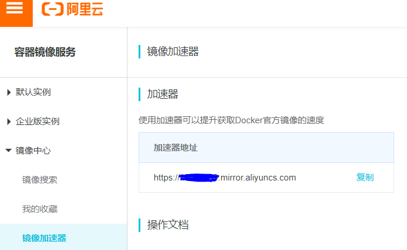
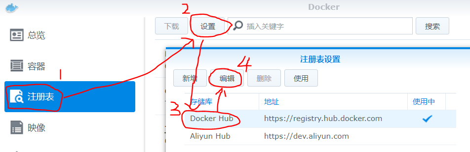
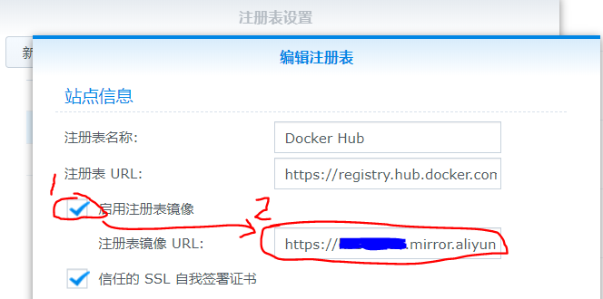

由于众所周知的原因，下载一些官方地址的容器镜像速度比较慢，这种时候可以使用阿里云的镜像加速器来帮助提升获取Docker官方镜像的速度。

### 1、获取镜像加速器的地址

登录阿里云容器镜像服务的`console`[页面](https://cr.console.aliyun.com/ap-northeast-1/instances/mirrors)，选择"镜像加速器"，在这个界面上就能看到自己账号的镜像加速地址了。

<!-- more -->




### 2、配置镜像加速器

#### 2.1、`ubuntu`/`centos`

修改节点上docker的配置文件/etc/docker/daemon.json来使用加速器

```shell
sudo mkdir -p /etc/docker
sudo tee /etc/docker/daemon.json <<-'EOF'
{
  "registry-mirrors": ["https://{你自己的地址}.mirror.aliyuncs.com"]
}
EOF
sudo systemctl daemon-reload
sudo systemctl restart docker
```

#### 2.2、群晖

如果你恰好又一台群晖的机器，也可以通过阿里云来加速。登录群晖的网页页面之后，在主菜单中打开docker->注册表，点击“设置”，选中“Docker Hub”，然后点击“编辑”。



进入编辑页面后选中“启用注册表镜像”，然后将前面获取到的镜像加速器的地址填进去就可以了，点击“确认”就能直接生效啦~

