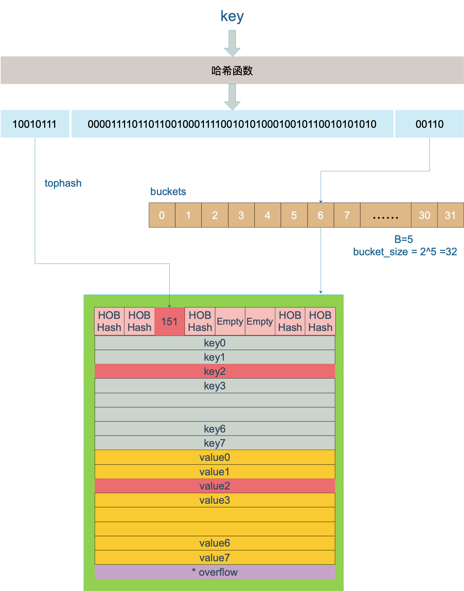
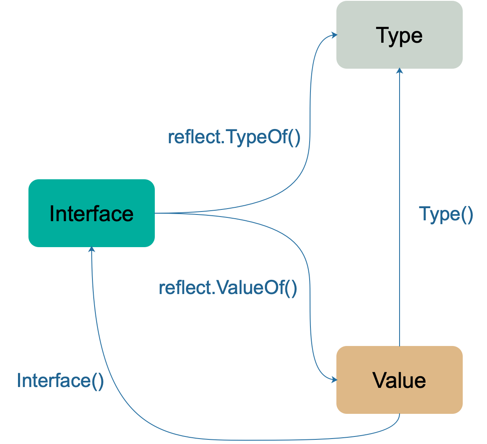

本文主要摘抄几位大佬的go语言笔记，用于平时复习记录用。

[TOC]

<!-- more -->

### 1、编译相关

有时候为了深入了解go runtime包相关的实现代码，需要查看go编译器转译的时候到底调用了什么函数，通过compile -S就可以查看到中间代码了。

```shell
$ go tool compile -S main.go
```


### 2、slice

**slice的数据结构**

```go
// runtime/slice.go
type slice struct {
	array unsafe.Pointer // 元素指针
	len   int // 长度 
	cap   int // 容量
}
```

**slice的append**

> 当原 slice 容量小于 `1024` 的时候，新 slice 容量变成原来的 `2` 倍；原 slice 容量超过 `1024`，新 slice 容量变成原来的`1.25`倍。（1.25倍不完全准确，实际是根据两个魔数数组来计算出来的）

**slice的创建**

```go
func makeslice(et *_type, len, cap int) slice
```

创建slice返回的是slice结构体，因此slice作为函数的入参时，虽然slice中的成员的是数组指针，但还是会因为扩容而导致发生变化。因此，如果函数中可能会对slice进行扩容，则需要将slice指针最为入参。

**slice的截取**

由于slice的底层数据结构是数组，因此当slice发生截取时，如果被截取的初始slice修改了数组中的值，对应截取的slice中的值也会发生变化。

```go
package main

import "fmt"

func main() {
	slice := []int{0, 1, 2, 3, 4, 5, 6, 7, 8, 9}
    s1 := slice[2:5]  // {2, 3, 4}
    slice[3] = 30     // s1 = {2, 30, 4}
}
```


### 3、map哈希表

**map的数据结构**

```go
type hmap struct {
	count     int    // 元素个数，调用 len(map) 时，直接返回此值
	flags     uint8  
	B         uint8  // buckets 的对数 log_2
	noverflow uint16 // overflow 的 bucket 近似数
	hash0     uint32 // 哈希的种子，计算 key 的哈希的时候会传入哈希函数，这个值在创建map时确定

	buckets    unsafe.Pointer // 指向bmap的数组，长度为 2^B，如果元素个数为0，就为 nil
	oldbuckets unsafe.Pointer // 扩容的时候，buckets 长度会是 oldbuckets 的两倍
	nevacuate  uintptr        // 指示扩容进度，小于此地址的 buckets 迁移完成

	extra *mapextra  // 
}

type mapextra struct {
	overflow    *[]*bmap  // 每一个bmap中可以放8个键值对
	oldoverflow *[]*bmap
	nextOverflow *bmap
}
// buckets的实际指向，其中bucketCnt=8
type bmap struct {
	tophash [bucketCnt]uint8
}
// 编译期间，上面的bmap会被动态替换成以下结构体
// 其中可以存储8个key-value对，另外还可以通过overflow字段进行拓展
type bmap struct {
    topbits  [8]uint8  // topbits是hash值的高8位，key和value都是根据这个topbit进行查找
    keys     [8]keytype
    values   [8]valuetype
    pad      uintptr
    overflow uintptr
}
```

map的数据结构可以详细看一下[饶全成的博客](https://www.qcrao.com/2019/05/22/dive-into-go-map/)以及[曹老师的博客](https://github.com/cch123/golang-notes/blob/master/map.md)中的内容，特别是高8位（定位桶中的key）和低位（定位哪个bucket桶）的部分。

**map的创建**

这里之所以要讲以下map的创建，是因为通过make创建出来的map其实是一个`*hmap`，是一个指针。因此在我们使用map的时候，特别是通过函数来传递map时，其实传递的是hmap指针，因此在函数中修改这个map是会实际对map进行修改的，这个和slice完全不一样。

```go
func makemap(t *maptype, hint int64, h *hmap, bucket unsafe.Pointer) *hmap {

}
```

**map的读写**

map中读写定位过程如下：

- 根据key的hash值的后`hmap.B`位确定这个key落在哪个bucket桶
- 根据key的hash值的前8位确定桶（bmap）中的位置，写map时，如果桶中没有对应的前8位，则找一个空位置存储这个key的hash值的前8位，然后讲key和value分别存入，读取map时，找到对应的前8位之后，还会继续判断key是否相等，相等时才会返回对应的value
- 如果当前bmap中没有当前这个key（hash前8位），则到其扩展（`bmap.overflow`）中继续寻找或者增加

以上过程可以通过下面这张图来表示（来自饶全成的博客）：



**map的扩容**

map扩容的条件：

- 装载因子（`loadFactor := count / (2^B)`）超过阈值，源码里定义的阈值是 6.5。
- overflow 的 bucket 数量过多：当 B 小于 15，也就是 bucket 总数 2^B 小于 2^15 时，如果 overflow 的 bucket 数量超过 2^B；当 B >= 15，也就是 bucket 总数 2^B 大于等于 2^15，如果 overflow 的 bucket 数量超过 2^15。

哈希在存储元素过多时会触发扩容操作，每次都会将桶的数量翻倍。扩容过程不是原子的，而是增量触发，扩容期间每次最多只搬运 2 个 bucket。在扩容期间访问哈希表时会使用旧桶，向哈希表写入数据和删除数据时会触发旧桶元素的分流。


**map的随机性**

在go语言的规则中，通过range来遍历map中的数据时，其读取顺序时随机的，举一个简单的例子就可以明白：

```go
func main() {
  hMap := map[int]int{0:0, 1:1, 2:2, 3:3, 4:4, 5:5}

  for i:=0; i<3; i++ {
    for item := range hMap {
      fmt.Print(item, " ")
    }
    fmt.Println("")
  }
}
// 可能的输出结果为：
// 1 2 3 4 5 0 
// 3 4 5 0 1 2 
// 0 1 2 3 4 5 
```

可以看到，输出的结果只是起始位置不一致，但是顺序都是一直的。

这是因为遍历map时，起始点的位置时随机产生的：

```go
// 生成随机数 r
r := uintptr(fastrand())
if h.B > 31-bucketCntBits {
	r += uintptr(fastrand()) << 31
}

// 从哪个 bucket 开始遍历
it.startBucket = r & (uintptr(1)<<h.B - 1)
// 从 bucket 的哪个 cell 开始遍历
it.offset = uint8(r >> h.B & (bucketCnt - 1))
```


### 4、channel

Channel 分为两种：带缓冲、不带缓冲。对不带缓冲的 channel 进行的操作实际上可以看作“同步模式”，带缓冲的则称为“异步模式”。

- 同步模式下，发送方和接收方要同步就绪，只有在两者都 ready 的情况下，数据才能在两者间传输（后面会看到，实际上就是内存拷贝）。否则，任意一方先行进行发送或接收操作，都会被挂起，等待另一方的出现才能被唤醒。
- 异步模式下，在缓冲槽可用的情况下（有剩余容量），发送和接收操作都可以顺利进行。否则，操作的一方（如写入）同样会被挂起，直到出现相反操作（如接收）才会被唤醒。


**channel发送和接收元素的本质**

值的拷贝，通过channel中的循环数组实现队列


**数据结构**


```go
type hchan struct {
	// chan 里元素数量
	qcount   uint
	// chan 底层循环数组的长度
	dataqsiz uint
	// 指向底层循环数组的指针
	// 只针对有缓冲的 channel
	buf      unsafe.Pointer
	// chan 中元素大小
	elemsize uint16
	// chan 是否被关闭的标志
	closed   uint32
	// chan 中元素类型
	elemtype *_type // element type
	// 已发送元素在循环数组中的索引
	sendx    uint   // send index
	// 已接收元素在循环数组中的索引
	recvx    uint   // receive index
	// 等待接收的 goroutine 队列
	recvq    waitq  // list of recv waiters
	// 等待发送的 goroutine 队列
	sendq    waitq  // list of send waiters

	// 保护 hchan 中所有字段
	lock mutex
}
```

- buf 指向底层循环数组，只有缓冲型的 channel 才有。数组中的元素是类型本身，而不是这个类型的指针，也就是说，通过channel发送和接收都是值传递。**注意是通过循环数组来缓存数据，其本质就是为了模拟队列~**

- sendx， recvx 均指向底层循环数组，表示当前可以发送和接收的元素位置索引值（相对于底层数组）。
- lock 用来保证每个读 channel 或写 channel 的操作都是原子的。

- sendq， recvq 分别表示被阻塞的 goroutine，这些 goroutine 由于尝试读取 channel 或向 channel 发送数据而被阻塞。需要体会的是，这两个队列不可能同时有值。

waitq 是 sudog 的一个双向链表，而 sudog 实际上是对 goroutine 的一个封装

```go
type waitq struct {
	first *sudog
	last  *sudog
}
```

**channel的发送**

- 如果当前 Channel 的 recvq 上存在已经被阻塞的 Goroutine，那么会直接将数据发送给当前的 Goroutine 并将其设置成下一个运行的协程；
- 如果 Channel 存在缓冲区并且其中还有空闲的容量，我们就会直接将数据直接存储到当前缓冲区 sendx 所在的位置上；
- 如果都不满足上面的两种情况，就会创建一个 sudog 结构并加入 Channel 的 sendq 队列，同时当前的 Goroutine 就会陷入阻塞等待其他的协程向 Channel 中发送数据以被唤醒；


**channel的接收**

数据时的几种情况：

- 如果 Channel 是空的，那么就会直接调用 gopark 挂起当前的 Goroutine；
- 如果 Channel 已经关闭并且缓冲区没有任何数据，chanrecv 函数就会直接返回；
- 如果 Channel 上的 sendq 队列中存在挂起的 Goroutine，就会将recvx 索引所在的数据拷贝到接收变量所在的内存空间上并将 sendq 队列中 Goroutine 的数据拷贝到缓冲区中；
- 如果 Channel 的缓冲区中包含数据就会直接从 recvx 所在的索引上进行读取；
- 在默认情况下会直接挂起当前的 Goroutine，将 sudog 结构加入 recvq 队列并等待调度器的唤醒；

```go
// 向一个非缓冲型的 channel 发送数据、从一个无元素的（非缓冲型或缓冲型但空）的 channel
// 接收数据，都会导致一个 goroutine 直接操作另一个 goroutine 的栈
// 由于 GC 假设对栈的写操作只能发生在 goroutine 正在运行中并且由当前 goroutine 来写
// 所以这里实际上违反了这个假设。可能会造成一些问题，所以需要用到写屏障来规避
func sendDirect(t *_type, sg *sudog, src unsafe.Pointer) {
	// src 在当前 goroutine 的栈上，dst 是另一个 goroutine 的栈

	// 直接进行内存"搬迁"
	// 如果目标地址的栈发生了栈收缩，当我们读出了 sg.elem 后
	// 就不能修改真正的 dst 位置的值了
	// 因此需要在读和写之前加上一个屏障
	dst := sg.elem
	typeBitsBulkBarrier(t, uintptr(dst), uintptr(src), t.size)
	memmove(dst, src, t.size)
}
```

这里涉及到一个 goroutine 直接写另一个 goroutine 栈的操作，一般而言，不同 goroutine 的栈是各自独有的。而这也违反了 GC 的一些假设。为了不出问题，写的过程中增加了写屏障，保证正确地完成写操作。这样做的好处是减少了一次内存 copy：不用先拷贝到 channel 的 buf，直接由发送者到接收者，没有中间商赚差价，效率得以提高，完美。

**channel的关闭**

原则：不要从一个 receiver 侧关闭 channel，也不要在有多个 sender 时，关闭 channel。

有两个不那么优雅地关闭 channel 的方法：

- 使用 defer-recover 机制，放心大胆地关闭 channel 或者向 channel 发送数据。即使发生了 panic，有 defer-recover 在兜底。
- 使用 sync.Once 来保证只关闭一次。

只有一个发送者或者只有一个接收者的情况，通过只有一个角色去关闭；

对于多个发送者和多个接收者的情况，需要增加一个stopCh用来专门传递关闭信号。

| 操作     | nil channel | closed channel                     | not nil, not closed channel                                  |
| -------- | ----------- | ---------------------------------- | ------------------------------------------------------------ |
| close    | panic       | panic                              | 正常关闭                                                     |
| 读 <- ch | 阻塞        | **未读取的缓存**或者对应类型的零值 | 阻塞或正常读取数据。缓冲型 channel 为空或非缓冲型 channel 没有等待发送者时会阻塞 |
| 写 ch <- | 阻塞        | panic                              | 阻塞或正常写入数据。非缓冲型 channel 没有等待接收者或缓冲型 channel buf 满时会被阻塞 |

需要注意的是，已经关闭的channel是可以从中获取数据的，如果这个channel中还有缓存的数据，那么就会继续返回缓存数据，否则直接返回0，其实也就是这个类型的0值。通过第二个返回值来判断是否已经关闭。但是已经关闭的channel不能往里面写，会panic。

问题：

1、一个channel有多个接收者时，信息是如何给各个接受者传递的，接收者的概率是一样的吗？

答：由于channel的接收者存在recvq中，信息是根据recvq队列中的先后顺序来发送给接收者的，因此接收者获取到信息是根据自己挂起（也就是当前协程进入channel的recvq队列）的顺序来获取。

2、已经关闭的channel中如果还有数据，接收者还能从中继续过去吗？

答：可以


**如何优雅地关闭channel**

https://go101.org/article/channel-closing.html


### 5、select语句

在编译期间，Go 语言会对 select 语句进行优化，它会根据 select 中 case 的不同选择不同的优化路径：

- 空的 select 语句会被转换成调用 `runtime.block` 直接挂起当前 Goroutine；
- 如果 select 语句中只包含一个 case，编译器会将其转换成 `if ch == nil { block }; n;` 表达式；
  - 首先判断操作的 Channel 是不是空的；
  - 然后执行 case 结构中的内容；
- 如果 select 语句中只包含两个 case 并且其中一个是 default，那么会使用 `runtime.selectnbrecv` 和 `runtime.selectnbsend` 非阻塞地执行收发操作；
- 在默认情况下会通过 `runtime.selectgo` 获取执行 case 的索引，并通过多个 if 语句执行对应 case 中的代码；

在编译器已经对 select 语句进行优化之后，Go 语言会在运行时执行编译期间展开的 runtime.selectgo 函数，该函数会按照以下的流程执行：

- **随机**生成一个遍历的轮询顺序 `pollOrder` 并根据 Channel 地址生成锁定顺序 lockOrder；
- 根据 pollOrder 遍历所有的 case 查看是否有可以立刻处理的 Channel；
  - 如果存在，直接获取 case 对应的索引并返回；
  - 如果不存在，创建 runtime.sudog 结构体，将当前 Goroutine 加入到所有相关 Channel 的收发队列，并调用 runtime.gopark 挂起当前 Goroutine 等待调度器的唤醒；
- 当调度器唤醒当前 Goroutine 时，会再次按照 lockOrder 遍历所有的 case，从中查找需要被处理的 runtime.sudog 对应的索引；

select 关键字是 Go 语言特有的控制结构，它的实现原理比较复杂，需要编译器和运行时函数的通力合作。


### 6、interface

主要用来实现duck模型，其中需要重点注意的是，interface的指针接收者无法接收初始化者是结构体的情况。如：

```go
type Duck interface {
	Quack()
}

type Cat struct{}

func (c *Cat) Quack() {
	fmt.Println("meow")
}

func main() {
	var c Duck = Cat{}
	c.Quack()
}

$ go build interface.go
./interface.go:20:6: cannot use Cat literal (type Cat) as type Duck in assignment:
	Cat does not implement Duck (Quack method has pointer receiver)
```

**数据结构**

interface根据其定义的方法是否为空分为两种不同的类型。

在go的底层实现中，空的interface{}是单独对待的，它的底层数据结构为eface：

```go
type eface struct { // 16 字节
	_type *_type
	data  unsafe.Pointer
}
```

由于 `interface{}` 类型不包含任何方法，所以它的结构也相对来说比较简单，只包含指向底层数据和类型的两个指针。从上述结构我们也能推断出 — Go 语言的任意类型都可以转换成 `interface{}`。

而普通包含了方法的interface的底层数据结构是iface：

```go
type iface struct { // 16 字节
	tab  *itab
	data unsafe.Pointer
}
```

这里的itab是最重要的字段：

```go
type itab struct { // 32 字节
	inter *interfacetype
	_type *_type
	hash  uint32
	_     [4]byte
	fun   [1]uintptr
}
```

其中：

- inter这个interfacetype是一个对 _type 类型的简单封装
- _type 字段是 Go 语言类型在运行时的内部结构，每一个 _type 结构体中都包含了类型的大小、对齐以及哈希等信息
- hash 字段其实是对 _type.hash 的拷贝，它会在从 interface 到具体类型的切换时用于快速判断目标类型和接口中类型是否一致
- fun 数组其实是一个动态大小的数组，如果如果当前数组中内容为空就表示 _type 没有实现 inter 接口

iface的整体数据结构如下：


interface类型的断言其实就是通过itab中的类型的hash值来判断的，这个字段既在itab._type.hash中，也在itab.hash中，两者其实是一致的。

从上面的数据结构图中可以看到，_type多次出现，这个成员保存了最关键的数据，其结构体定义如下：

```go
type _type struct {
    // 类型大小
	size       uintptr
    ptrdata    uintptr
    // 类型的 hash 值
    hash       uint32
    // 类型的 flag，和反射相关
    tflag      tflag
    // 内存对齐相关
    align      uint8
    fieldalign uint8
    // 类型的编号，有bool, slice, struct 等等等等
	kind       uint8
	alg        *typeAlg
	// gc 相关
	gcdata    *byte
	str       nameOff
	ptrToThis typeOff
}
```

需要注意的是，`_type`中保存的是数据的实际类型，例如实例的类型是os.File，即使是通过os.Reader传递过来的，其interface的_type中存的仍然是os.File。


**interface与nil**

只有当iface中的tab和data都为空时，interface才为nil。因此，即使一个只被类型赋值的interface也不为空。

接口值的零值是指动态类型和动态值都为 nil。当仅且当这两部分的值都为 nil 的情况下，这个接口值就才会被认为 接口值 == nil。


**类型断言**

interface常用的方式就是用来进行类型断言，当多个类型都实现了相同的interface时，为了能区分实际的类型，需要通过断言来判断。

> <目标类型的值>，<布尔参数> := <表达式>.( 目标类型 ) // 安全类型断言
> <目标类型的值> := <表达式>.( 目标类型 )　　//非安全类型断言

如前所述，类型断言本质上就是通过类型的hash值来判断，go runtime中会有一个全局的hash表用来保存常用的类型hash。


### 7、反射

反射的法则

- 从接口值可反射出反射对象；
- 从反射对象可反射出接口值；
- 要修改反射对象，其值必须可设置；（利用反射机制，对于结构体中未导出成员，可以读取，但不能修改其值。）

需要注意的是，反射一般是和interface一起配合使用的。

reflect 包里定义了一个接口和一个结构体，即 `reflect.Type` 和 `reflect.Value`，它们提供很多函数来获取存储在接口里的类型信息。

`reflect.Type` 主要提供关于类型相关的信息，所以它和 `_type` 关联比较紧密；`reflect.Value` 则结合 `_type` 和 `data` 两者，因此程序员可以获取甚至改变类型的值。reflect 包中提供了两个基础的关于反射的函数来获取上述的接口和结构体：

```go
func TypeOf(i interface{}) Type  // 返回值Type其实是一个interface
func ValueOf(i interface{}) Value // 
```

`TypeOf` 函数用来提取一个接口中值的类型信息。由于它的输入参数是一个空的 `interface{}`，调用此函数时，实参会先被转化为 `interface{}`类型。这样，实参的类型信息、方法集、值信息都存储到 `interface{}` 变量里了。

```go
func TypeOf(i interface{}) Type {
	eface := *(*emptyInterface)(unsafe.Pointer(&i))
	return toType(eface.typ)
}

func toType(t *rtype) Type {// 这里的rtype其实就是eface的_type
	if t == nil {
		return nil
	}
	return t
}
```

`ValueOf` 函数的返回值 `reflect.Value` 表示 `interface{}` 里存储的实际变量，它能提供实际变量的各种信息。相关的方法常常是需要结合类型信息和值信息。例如，如果要提取一个结构体的字段信息，那就需要用到 _type (具体到这里是指 structType) 类型持有的关于结构体的字段信息、偏移信息，以及 `*data` 所指向的内容 —— 结构体的实际值。

```go
func ValueOf(i interface{}) Value {
	if i == nil {
		return Value{}
	}
	
   // ……
	return unpackEface(i)
}

// 分解 eface
func unpackEface(i interface{}) Value {
	e := (*emptyInterface)(unsafe.Pointer(&i))

	t := e.typ
	if t == nil {
		return Value{}
	}
	
	f := flag(t.Kind())
	if ifaceIndir(t) {
		f |= flagIndir
	}
	return Value{t, e.word, f}
}
```

通过 `Type()` 方法和 `Interface()` 方法可以打通 `interface`、`Type`、`Value` 三者。Type() 方法也可以返回变量的类型信息，与 reflect.TypeOf() 函数等价。Interface() 方法可以将 Value 还原成原来的 interface。




主要参考

draveness的博客：https://draveness.me/golang/

饶全成的博客：https://www.qcrao.com/