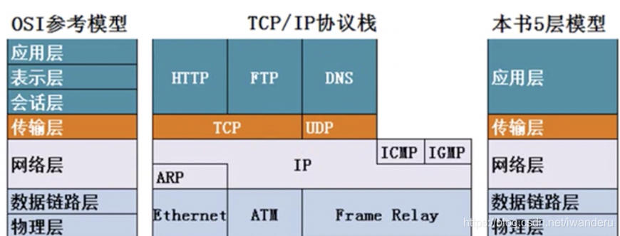
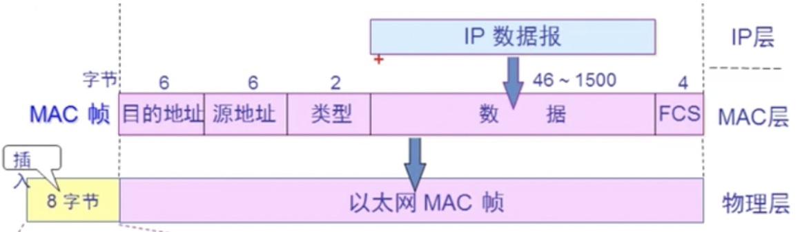
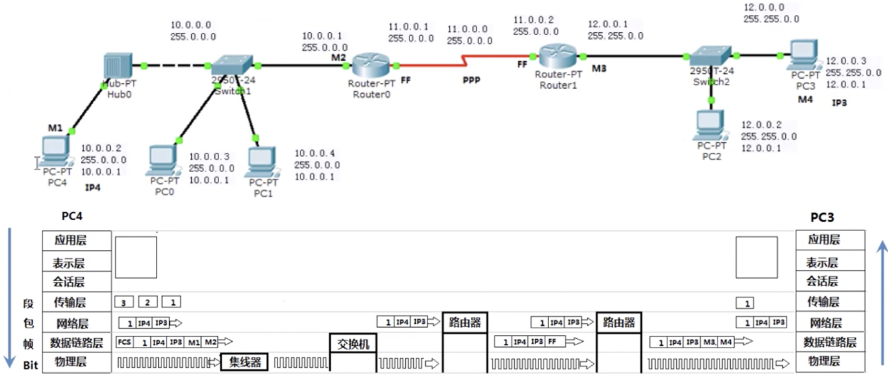
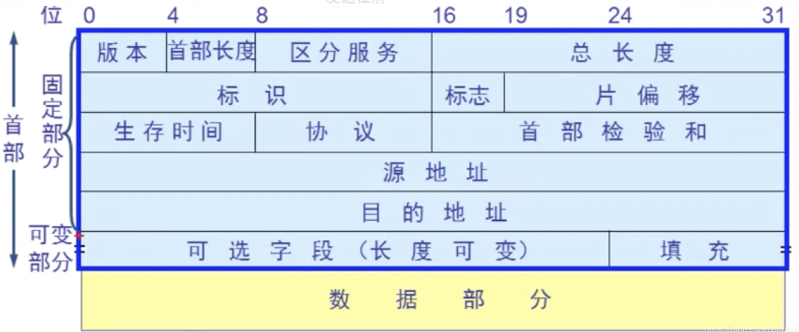
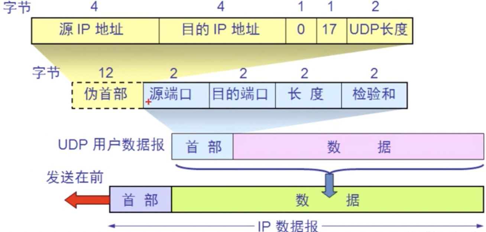
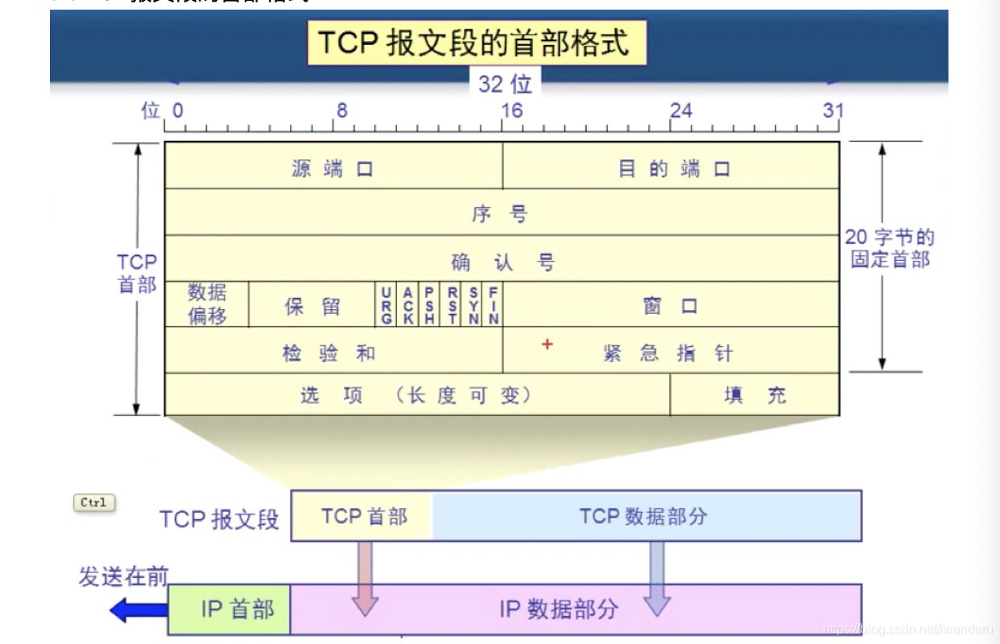
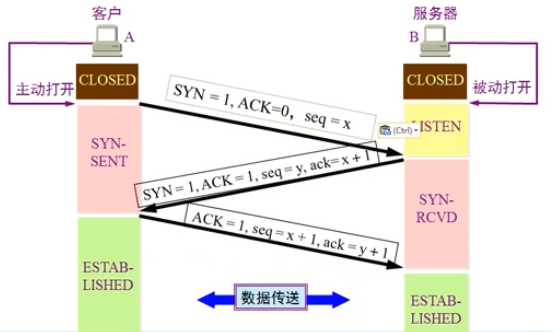
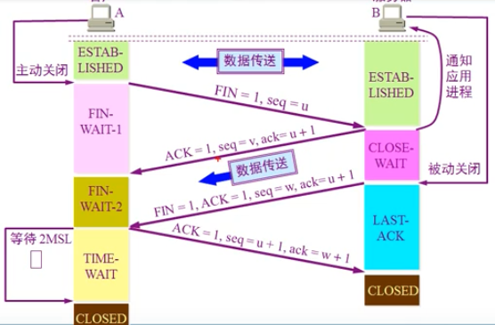

本文主要基于韩立刚老师的计算机网络课程总结而来。

B站视频的地址：https://www.bilibili.com/video/BV1Qr4y1N7cH

部分文字和图片参考以下文章：

- iwander。：https://blog.csdn.net/iwanderu/article/details/103795715

<!-- more -->

## 第一章 计算机网络概述

**OSI七层模型**

> **程序开发者关心的：**
>
> 应用层——所有能产生网络流量的程序
> 表示层——在传输之前是否进行加密 或 压缩 处理，二进制或ASCII码表示
> 会话层——查木马，看需求端和网站之间的连接
>
> **网络工程师关心的：**
>
> 传输层——可靠传输，流量控制，不可靠传输(一个数据包即可，不需要建立会话，例如向DNS查询网站IP地址) TCP/UDP
> 网络层——负责选择最佳路径，规划IP地址(ipv4和ipv6变化只会影响网络层)
> 数据链路层——帧的开始和结束，还有透明传输，差错校验(纠错由传输层解决)
>
> **电气工程师关心的：**
>
> 物理层——定义网络设备接口标准，电气标准(电压)，如何在物理链路上传输的更快

**计算机网络的性能**

速率、带宽、吞吐量、时延、时延带宽、往返时间、利用率

## 第二章、物理层

物理层解决如何在链接各种计算机的传输媒体上传输数据比特流，而不是指具体的传输媒体。
物理层的主要任务：确定传输媒体的接口的一些特性，包括，
机械特性：接口形状，大小，引线数量
电气特性：例如规定电压范围(-5V-5V)
功能特性：例如规定-5V上0，+5V是1
过程特性：也称规程特性，规定建立连接时各个相关部件的工作步骤

**信道**：单工通信、半双工通信、全双工通信

**信号的调制方法**：调幅（AM）、调频（FM）、调相（PM）

**编码方式**：单极性不归零编码、双极性不归零编码、单极性归零编码、双极性归零编码、曼彻斯特编码（通过跳变表示）、差分曼彻斯特编码

**传输介质**：双绞线、同轴电缆、光缆

**物理层设备**：集线器、交换机

**信道复用**：频分复用、时分复用、波分复用、码分复用

**带宽接入技术**：非对称数字用户链路ADSL（电话线）、DMT技术（频分复用）、光纤同轴混合网HFC、FTT技术(光纤到XX技术)

## 第三章：数据链路层

数据链路层不关心物理层解决的问题，只关心帧头帧尾和校验。

**信道类型**：点到点信道、广播信道

**数据链路层解决的基本问题**：封装成帧（帧头帧尾）、透明传输（字节填充）、差错校验（循环冗余检验CRC）

**以太网**

以太网提供服务是不可靠的交付，即最大努力的交付；当接收站收到的有差错的数据帧时就丢弃此帧，其它什么也不做，差错的纠正由高层来处理；如果高层发现丢失了一些数据而进行重传，但以太网并不知道这是一个重传的帧，而是当作一个新帧发送。

**MAC层**

硬件地址 = 物理地址 = MAC地址
MAC地址前3个字节(24位)是厂家分配的地址字段，后3个字节(24位)是厂家自定义，称为扩展标识符；

MAC帧的格式：目的地址+原地址+协议类型（IP）+数据（IP数据报最小46字节）+FCS（帧校验队列）

**数据链路层的扩展**

网桥、交换机、透明网桥

## 第四章、网络层

作用：负责在不同的网络之间(基于数据包的IP地址)尽力转发数据包，不负责丢包重传和接收顺序。

包含的协议：IP、ARP、ICMP、IGMP

**互联网互联的设备**

> 物理层中继系统：转发器(repeater)，有点像集线器。
> 数据链路层中继系统：网桥或桥接器(bridge)。
> 网络层中继系统：路由器(router)。
> 传输层/应用层中继系统：网关(gateway)器。
> 网关就是路由器接口的地址。一般是本网段第一个地址。

**网络中数据的发送和接收过程**

发送端(封装)：

> (1)应用层准备要传输的数据；
> (2)传输层把文件进行分段并编号；(**数据段**)
> (3)网络层把传输层的每一个数据包增加原IP地址和目标IP地址；(**数据包**)
> (4)数据链路层把每个数据加上MAC地址；两种情况：(**数据帧**)
> 使用自己的子网掩码，判断自己和目标地址分别在哪个网段，若在同一个网段(不过路由器)，通过ARP协议广播的方式得到目标IP地址的MAC地址，然后就能封装出一个数据帧；如果子网掩码不是一个网段(用与运算)，通过ARP协议广播的方式得到路由器(网关)的MAC地址，然后把数据通过交换机发送到路由器M2，因为M2和M3是点对点通信，没有别的主机，所以它们之间的MAC地址就是FF。
> (5)物理层把数据帧变成数字信号(bit流)

接收端(解封)：

> (1)交换机Hub0接收bit流，能对数据进行存储转发。它根据数据帧的MAC地址，确定数据是从哪来的，要去哪。
> (2)路由器M2获取交换机的数据包，识别其中的IP地址，根据路由表选择出口，它无法识别数据段内容。
> (3)路由器M2到M3是点对点通信，遵守PPP协议。
> (4)PC3收到bit流后，数据链路层发现MAC地址是自己的，去掉MAC地址给它的网络层，网络层去掉IP地址给传输层，传输层把数据给应用层，应用层把各个数据拼接起来。

**数据链路层和网络层的作用**

数据链路层对应MAC地址，网络层对应IP地址：

- 交换机给予数据帧的MAC地址转发数据，路由器给予数据包的IP地址转发数据包
- 数据包在传输过程中不变，过网络设备数据帧要用新的MAC地址重新封装
- MAC地址决定了数据帧下一跳哪个设备接收，而IP地址决定了数据包的起点和终点

**ARP协议**

负责将IP地址转换成MAC地址。通过广播实现。ARP是为IP服务的。

广播：将IP地址通过广播(本网段，不通过路由器)，目标MAC地址是FF-FF-FF-FF-FF-FF，解析目标IP地址的MAC地址。

ARP欺骗：伪装成其他主机，使其他主机缓存错误的映射。

**网际控制报文协议ICMP**

在IP之上，用来测试网络层有没有故障。使用最多的命令是ping。

PING是网络层命令。

TTL是数据报的生存时间每过一个路由器就会减1，作用是防止数据报在网络中循环。TTL默认初始值如下：
Linux 64
Windows 128
Unix 256
可以根据TTL值粗略判定对方是什么系统。

**IGMP协议**

IGMP协议的作用就是周期性扫描本网段内有没有主机在访问多播数据包

**IP协议（重点）**

IP数据包的结构

首部大小固定为20字节，其中包含的内容如下：

- 版本：用来表示TCP/IP是哪个版本，ipv4还是ipv6.

- 区分服务：确定更高的传输优先级。

- 总长度：确定数据部分长度。一共是16位，最多有2^16-1=65535字节。

- 标识：如果出现数据包分片，那么标识用来确定哪些数据包是需要组合的。

- 标志：确定该数据包是完整的还是分片中的一部分。占3位，只有前两位有用，标志字段最低位是MF(More Fragment)，MF=1表示后面还有分片，MF=0表示最后一个分片。标志字段中间一位是DF(Don’t Fragment)，只有DF=0才允许分片。

- 片偏移：偏移等于当前字节在数据部分的第几个再除以8.(下图是一个举例)

- 生存时间：就是TTL，time to live，每过一个路由器就减1。8位二进制。防止数据包在网络中循环。

- 协议：用协议号标识数据部分是什么数据。(ICMP:1；IGMP:2；TCP:6；UDP:17；IPv6:41；OSPF:89)

- 首部检验和：16位，只检验数据报的首部，不检验数据部分。这里不是采用CRC检验码而是采用简单的计算方法。每经过一个路由器就会检验一次。

- 源地址和目的地址都是IP地址，32位，只符合IPv4。IPv6是128位。

- 可变部分：一般没用。

**NAT网络地址转换**

内网地址与公网地址之间的转换。

数据包从局域网出去之前将源IP修改成路由器公网地址。

数据包从公网回来时将路由器公网地址修改成局域网地址。

NAT设备有个NAT转换表，这个表记录了，NAT设备收到的回包，接下来应该转发给哪台内部主机。

## 第五章、传输层

**传输层协议**

- TCP(Transmission Control Protocol)传输控制协议：分段、编号、流量控制，建立会话，可靠。
- UDP(User Data Protocol)用户数据报协议：一个数据包就能完成数据通信，不建立会话，多播

传输层和应用层之间的关系：http=TCP+80，https=TCP+443，ftp=TCP+21，SMTP=TCP+25，POP3=TCP+110，共享文件夹=TCP+445，DNS=UDP+53 or TCP+53。用ip定位服务器，用端口定位应用。

**UDP首部格式**

**TCP首部格式**

(1)源端口：2个字节16位。
(2)目的端口：2个字节16位。
(3)序号：当前数据的第一个字节在整个文件中的序号。
(4)确认号ack：接收端发送，提示发送端下一次该发的数据在整个文件中的序号。接收端收到后，会把这个序号之前的数据从缓存中删掉。
(5)数据偏移：当前TCP报文段第多少个字节后是TCP的数据部分了（也就是TCP首部的长度）。数据偏移最多表示1111，即15，他最多可以表示15乘以4，即60个字节的偏移量，所以选项+填充最多只能是40个字节。
(6)保留：6位，无作用。
(7)URG：urgent，意思是优先级高，发送端优先发送，而不是在缓存中排队。
(8)ACK：acknowledge，1意味着确认建立了会话。
(9)PSH：1意味着接收端优先读取，而不是在缓存中排队。
(10)RST：reset，1意味着TCP会话出现严重错误，必须释放和重新连接。
(11)SYN：同步。1意味着要发起会话。
(12)FIN：finish，1意味着释放连接。
(13)窗口：接收端先发，发送端根据接收端的窗口（缓存）尺寸确定发送端窗口尺寸。
(14)检验和：检验TCP首部的长度。
(15)紧急指针：只有URG为1才有用。

**TCP协议的特点**

- TCP是面向连接的传输层协议。(三次握手)

- 每一条TCP连接智能有两个端点(endpoint)，每一条TCP连接只能时点对点的(一对一)。

- TCP提供可靠交付的服务。(确保不丢包)

- TCP提供全双工通信。(因为需要接收端的反馈，例如如果接收端处理不过来，可让发送端慢一点，流量控制)

- 面向字节流。

**TCP协议实现可靠性传输的方法**

连续ARQ协议（滑动窗口）

**TCP协议实现流量控制的方法**

- 以字节为单位的晃动窗口技术
- 超时重传

**TCP传输连接管理**

建立连接：三次握手

- 客户端A向服务端B发送主动发起连接的数据包（SYN=1，ACK=0，seq=x），A的状态变成SYN-SENT
- 服务端B收到请求后返回已经收到发起连接的数据包（SYN=1，ACK=1，seq=y，ack=x+1），服务端状态变成SYN-RCVD
- 客户端收到信号后给服务端发起已经收到回复的数据包（ACK=1，seq=x+1，ack=y+1），并开始进行数据通信，客户端状态变成ESTABLISHED

第三次握手原因：假如把三次握手改成仅需要两次握手，死锁是可能发生的。作为例子，考虑计算机A和B之间的通信，假定A给B发送一个连接请求分组，B收到了这个分组，并发送了确认应答分组。按照两次握手的协定，B认为连接已经成功地建立了，可以开始发送数据分组。可是，B的应答分组在传输中被丢失的情况下，A将不知道B是否已准备好，A认为连接还未建立成功，将忽略B发来的任何数据分组，这样就形成了死锁。

释放连接：四次挥手

- 客户端A向服务端B发送结束连接的请求（FIN=1，seq=u），并且将状态变成FIN-WAIT-1
- 服务端B收到请求后给客户端A发送已收到客户端的结束连接请求（ACK=1）（此时服务端可能还未将数据发送完成，可以继续发送），并且状态变成CLOSE-WAIT，客户端收到请求后状态变为FIN-WAIT-2
- 服务端B处理完之后给客户端A发送结束连接的请求（FIN=1，ACK=1，seq=w，ack=u+1），并且状态变成LAST-ACK
- 客户端A收到请求后给服务端B发送请求（ACK=1，seq=u+1，ack=w+1），并且状态变成TIME-WAIT，并等待2MSL后变成CLOSED，期间如果再次收到服务端的结束请求可以再响应，服务端B收到确认请求后状态变成CLOSED

为什么事四次而不是三次：

- 假如第三次去掉，服务端可能会有未发送完的数据
- 接入第四次去掉，服务端无法确认客户端已经收到了结束的消息

