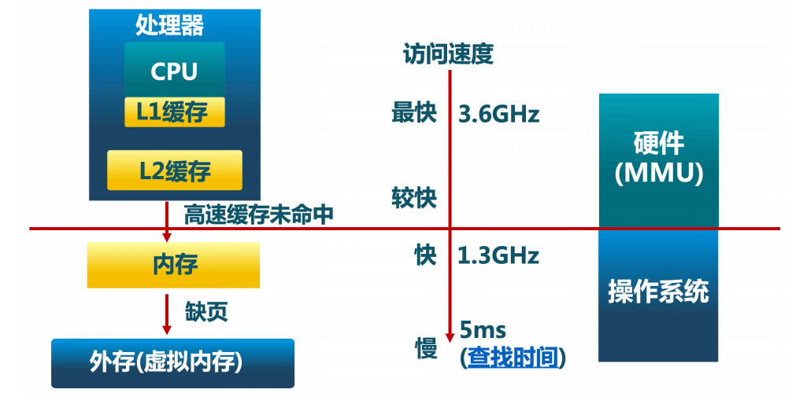
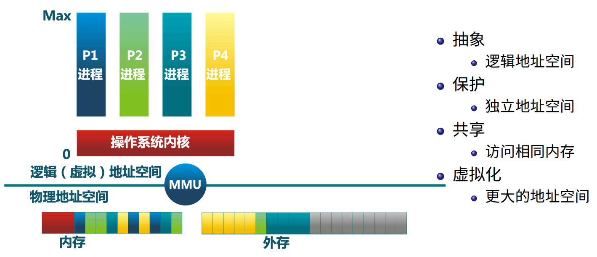
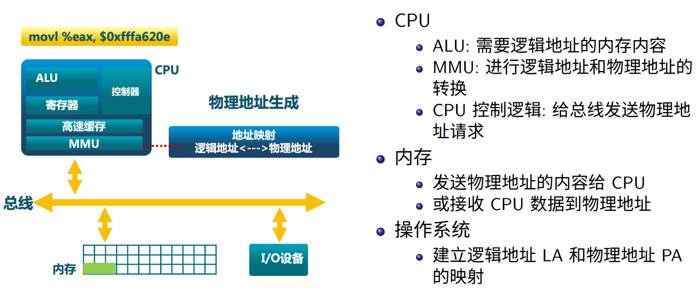
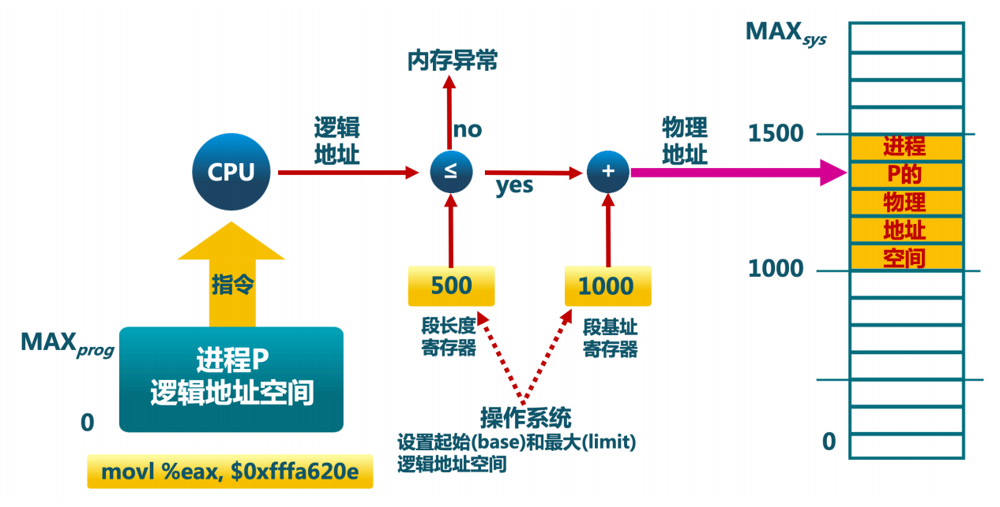
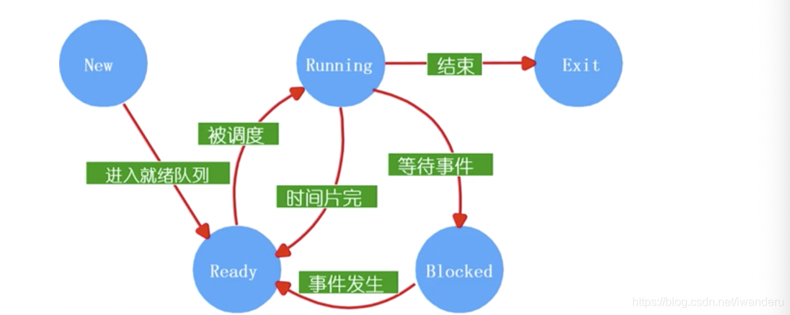
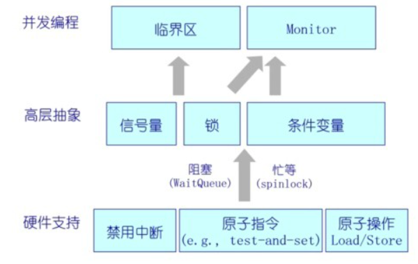
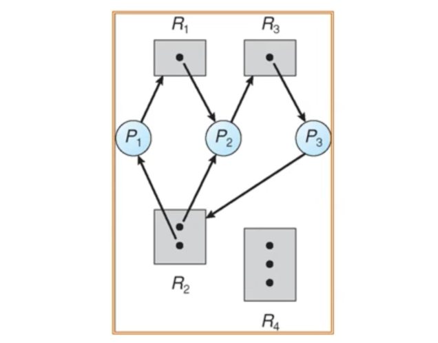
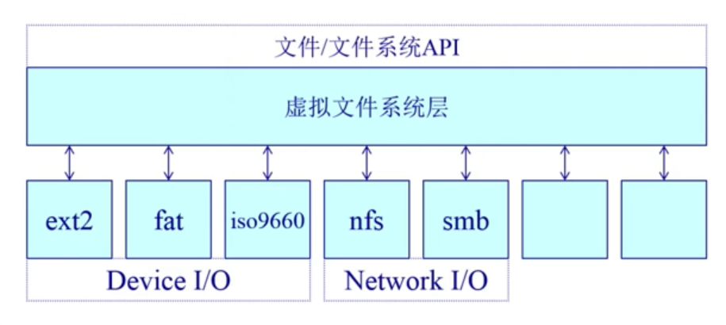
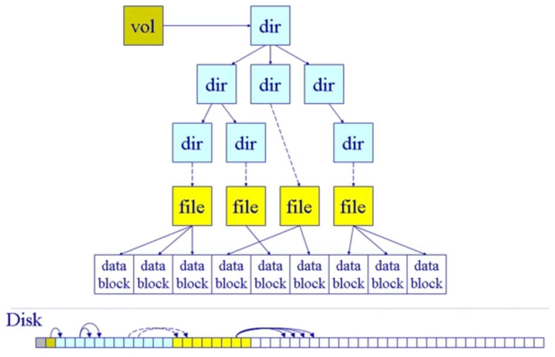

本文主要基于清华大学课程陈渝老师的操作系统课程总结而来。

B站视频的地址为：https://www.bilibili.com/video/BV1uW411f72n

课件地址为：https://github.com/dramforever/os-lectures-build/releases。

同时部分文字和图片参考以下文章：

- 向往生活日记：https://zhuanlan.zhihu.com/p/150510828
- iwander。：https://blog.csdn.net/iwanderu/article/details/103934127

<!-- more -->

## 第零章、简要版

操作系统内核组件：CPU调度器、物理内存管理、虚拟内存管理、文件系统管理、中断处理和IO设备驱动
操作系统基础操作：启动/中断/异常/系统调用
**内存管理**

- 连续式内存分配（分段/分页/虚拟内存，首次/最佳/最差分配策略，压缩式/交换式碎片整理）
- 非连续内存分配（分段/分页，页表用来映射逻辑页到物理帧，操作系统建立，通过CPU硬件MMU支持，多级页表，反向页表）

**虚拟内存**：解决物理内存不够的问题

- 覆盖技术（分时复用内存，程序员实现）

- 交换技术（将暂时不能运行的程序送到外存，操作系统实现）

- 虚存技术（程序运行时仅将部分页放入内存，缺页时通过中断置换）

**页面置换算法**

- 局部页面置换：最优页面置换、先进先出、最近最久未使用、时钟页面置换、二次机会法、最不常用算法

- 全局页面置换：工作集置换算法、缺页率页面置换算法

**进程与线程**

- 进程的组成：程序的代码、程序处理的数据、程序计数器的值，指示下一条将运行的指令、一组通用的寄存器的当前值，堆，栈、一组系统资源(如打开的文件)
- 进程控制块（PCB）：操作系统管理控制进程运行所有的信息集合，通过链表组织
	- 进程标识信息：本进程/父进程/用户标识
	- 处理机状态信息保存区：程序寄的各类存器、栈指针等
	- 进程控制信息：调度和状态信息、进程间通信信息、存储管理信息、进程所用资源、有关数据结构等连接信息
- 进程的生命周期：
	- New/Running/Ready/Blocked/Exit着物种状态的转换
	- 进程挂起：把一个进程从内存转到外存
- 线程：进程中的一条执行流程，进程可以视为一个资源管理的平台，其中的线程负责执行。实现方式有用户线程/内核线程/轻量级线程
  - 进程是资源分配的单位，线程是CPU调度单位
  - 进程拥有完整的资源平台，而线程只占有必须的资源，如寄存器，栈
  - 线程同样由就绪，阻塞，执行三种基本状态，同样具有状态之间的转换关系
  - 线程能减少并发执行的时间和空间开销：线程切换时间比进程短，不需要切换页表等等
- 上下文切换：切换进程的时候，保存该进程恢复时需要用到的必要数据化，例如程序计数器、栈指针等等

**CPU调度**

- 进程/线程从一个状态到另一个状态的时候会发生调度

- 指标：CPU使用率、吞吐量、周转时间、等待时间、响应时间

- 基本调度算法：FCFS/SPN(SJF)SRT/HRRN/Round Robin/多级反馈队列/fair share

**同步**

- 无论多个线程的指令序列怎样交替执行，程序都必须正常工作。

- 临界区/互斥/死锁/饥饿

- 临界区的实现方法：禁用硬件中断/基于软件/通过锁

**信号量和管程**：信号量通过计数器实现，管程通过锁和条件变量实现

- 经典同步问题：读者-写者问题、哲学家就餐问题

**死锁和进程通信**

- 死锁通过有向图是否有环来判断

- 死锁的处理方法：死锁预防、死锁避免、死锁检测、死锁回复

- 进程间通信的方法：信号、管道、消息队列、共享内存

**文件系统**

- 基本概念：文件系统、文件、文件描述符、目录、别名需
- 拟文件系统：对所有不同文件系统抽象。包括卷控制块、文件控制块、目录节点
- 文件分配：连续分配、链式分配、索引分配
- 空闲空间管理：用位图代表空闲数据块的列表


## 第一章、概述

**操作系统的定义**

操作系统是一个控制软件，用来：

- 管理应用程序
- 为应用程序提供服务（IO等）
- 杀死应用程序
- 资源管理（计算资源、网络资源、存储资源等）
- 管理外设/分配资源

**操作系统内核组件**

- CPU调度器（进程线程管理调度）
- 物理内存管理
- 虚拟内存管理（在物理内存的基础上给应用程序提供更大的内存）
- 文件系统管理
- 中断处理和IO设备驱动 (底层硬件)

**操作系统内核的特征**

- 并发(指一段时间内多个程序运行；而并行是指一个时间点上多个程序运行，要求多个CPU):计算机系统中同时存在多个运行的程序，需要OS管理和调度
- 共享：“同时”访问 或 互斥共享
- 虚拟：利用多道程序设计技术，让每一个用户都觉得有一个计算机专门为他服务
- 异步：程序的执行不是一步到底的，而是走走停停，向前推进的速度不可预知

**操作系统历史**

- 单用户系统
- 批处理系统：操作系统 = 装载器 (loader)+ 程序控制器 (sequencer)+ 输出处理器 (output
  processor)
- 多道程序系统：多个程序驻留内存，轮流使用CPU
- 分时系统：增加了中断处理
- 个人计算机
- 分布式计算

**操作系统结构**

- 简单结构：MS-DOS，在最小的空间, 设计用于提供大部分功能
- 单体分层结构：将单体操作系统 (Monolithic OS) 划分为多层 (levels)，每一层仅使用更低一层的功能和服务
- 微内核结构：尽可能把内核功能移到用户空间，用户模块间的通信使用消息传递，灵活/安全，但是性能低
- 外核结构 Exokernel：让内核分配机器的物理资源给多个应用程序, 并让每个程序决定如何处理这些
  资源
- 虚拟机结构：虚拟机管理器将单独的机器接口转换成很多的虚拟机, 每个虚拟机都是一个原
  始计算机系统的有效副本, 并能完成所有的处理器指令。


## 第二章、操作系统基础操作


**操作系统的启动**

OS存放在disk上，BIOS（基本IO处理系统），Bootloader加载OS到内存中

启动：过程BIOS首先将BootLoader（第一个扇区）加载到内存并执行，BootLoader将OS加载到内存，然后跳转到操作系统的起始地址。

**系统调用、异常、中断**

外设通过中断向操作系统发出服务请求

应用程序则是通过系统调用（主动）和异常（非法指令或坏处理状态）

为什么应用程序不能直接访问硬件而是通过操作系统？

- 计算机运行时，内核是被信任的第三方
- 只有内核可以执行特权指令
- 为了方便应用程序


|          | 产生的源头                                                   | 处理时间   | 响应                                   |
| -------- | ------------------------------------------------------------ | ---------- | -------------------------------------- |
| 中断     | 外设(键盘/鼠标/网卡/声卡/显卡，可以产生各种事件)             | 异步       | 持续，对用户应用程序是透明的           |
| 异常     | 应用程序意想不到的行为(e.g.异常，恶意程序，应用程序需要的资源未得到满足) | 同步       | 杀死或者重新执行意想不到的应用程序指令 |
| 系统调用 | 应用程序请求操作提供服务(e.g.打开/关闭/读写文件，发送网络包) | 同步或异步 | 等待和持续                             |


**中断/异常处理机制**
中断是外设的事件，异常是CPU的事件；中断/异常迫使CPU访问一些被中断和异常服务访问的功能

|          | 处理机制                                                     |
| -------- | ------------------------------------------------------------ |
| 中断     | 硬件：设置中断标记(CPU初始化)<br/>- 将内部/外部事件设置中断标记；<br/>- 中断事件的ID(程序访问的中断向量地址)<br/>软件(操作系统)：<br/>- 保存当前处理状态<br/>- 中断服务程序处理<br/>- 清除中断标记<br/>- 恢复之前保存的处理状态 |
| 异常     | 异常：异常编号<br/>- 保存现场<br/>- 异常处理：杀死产生异常的程序；重新执行异常指令<br/>- 恢复现场 |
| 系统调用 | 通过高层次的API（win32或者POSIX）接口而不是直接进行系统调用<br/>- 通常情况下，存在与每个系统调用相关的序号，系统调用接口根据这些序号来维护表的索引。<br/>- 系统调用接口调用内核态中预期的系统调用，并返回系统调用的状态和其它任何返回值。<br/>- 用户不需要知道系统调用是如何实现的，只需要获取API和了解操作新系统将什么作为返回结果。操作系统接口的细节大部分都隐藏在API中，并通过运行程序支持的库来管理。 |

**用户态和内核态**

- 用户态：应用程序在执行的过程中，CPU执行的特权级的状态(很低，不能访问特殊机器指令和IO)。

- 内核态：应用程序在执行的过程中，CPU执行的特权级的状态(高，操作系统可以执行CPU任何一条指令)。

- 系统调用时涉及到特权级从用户态到内核态的转换，应用程序和操作系统有各自的堆栈，这两个变化比函数调用的开销更大，但更安全和可靠。(而程序调用是在一个栈空间实现参数的调用和返回)。

**跨越操作系统边界的开销**

- 在执行时间上超过程序调用

- 开销包括：
  建立中断/异常/系统调用号与对应服务例程映射关系的初始化开销；
  建立内核堆栈(操作系统和应用程序的堆栈不一样)；
  验证参数(操作系统会检查数据)；
  内核态映射到用户态的地址空间，更新页面映射权限(内存拷贝开销)；
  内核态独立地址空间TLB。


## 第三章、连续式内存分配

计算机**基本硬件结构**：内存、CPU、设备（I/O）

**内存层次**




**操作系统在内存管理要完成的目标**

- 抽象：逻辑地址空间

- 保护：独立地址空间

- 共享：访问相同内存

- 虚拟化：更多的地址空间



**操作系统实现内存管理目标的手段**

- 程序重定位

- 分段

- 分页

- 虚拟内存

- 按需分页虚拟内存

操作系统对内存的管理强烈依赖于硬件：MMU（内存管理单元），保存物理地址和逻辑地址的映射关系

**地址空间&地址生成**

定义

物理地址空间：硬件支持的地址空间

逻辑地址空间：一个运行的程序所拥有的内存范围

地址生成过程



地址检查：通过段基址寄存器和段长度寄存器来实现



**连续内存分配**

内存碎片问题：空闲内存不能被利用
外部碎片：在分配单元间的未使用内存
内部碎片：在分配单元中的未使用内存

动态分配策略（分配n字节）：

- 首次适配：从低地址开始找，碰到的第一个空间比n大的空闲块就使用它
- 最佳适配：使用最小的可用空闲块，空闲链表需要按照空间大小排序
- 最差适配：使用最大的可用空闲块，空闲链表需要按照空间大小排序

**压缩式碎片整理**

- 将稀疏分布的程序排列合并

- 要求所有程序是 动态可重置的

- 问题：何时重置；开销。

**交换式碎片整理**

将等待的程序所使用的空间挪到磁盘里，回收这部分内存


## 第四章、非连续式内存分配

**连续内存分配的问题**

- 分配给一个程序的物理内存是连续的

- 内存利用率低

- 有外碎片/内碎片问题

**非连续内存分配的优缺点**

| 优点                                                         | 缺点                                                         |
| ------------------------------------------------------------ | ------------------------------------------------------------ |
| 1 分配给一个程序的物理内存是非连续的<br/>2 更好的内存利用和管理<br/>3 允许共享代码和数据(共享库等)<br/>4 支持动态加载和动态链接 | 如何建立虚拟地址和物理地址之间的转换<br/>1 软件方案(开销大)<br/>2 硬件方案(需要硬件支持) |

非连续内存分配的两种硬件方案

> 分段Segmentation
> 分页Paging

**分段**

应用程序的地址空间包含：堆、运行栈、程序数据、程序text段。因此可以将这几部分空间分开进行管理，使得其逻辑地址空间是连续的，物理地址是离散的。

段表是由操作系统来建立的。

**分页**

分页方法

- 划分物理内存至固定大小的帧（frame）  物理地址：帧号+帧内偏移量

- 划分逻辑地址空间至相同大小的页（page）  逻辑地址：页号+页内偏移量
  - 其中帧内偏移量=页内偏移量 而 帧号不一定等于页号
- 建立方案：转换逻辑地址为物理地址(pages to frames)
  - 页表Page Table（保存逻辑地址与物理地址之间的映射关系，由操作系统来建立）
  - MMU/TLB

页寻址机制

- 页映射到帧
- 页是连续的虚拟内存
- 帧是非连续的物理内存
- 不是所有的页都有对应的帧（部分页是映射到swap）


**页表-概述/TLB**

分页机制存在的时间/空间性能问题

1、访问一个内存单元需要2次内存访问：一次获取页表项；一次是访问数据。

2、页表可能会非常大(页表的长度等于2^页号位数)

分页性能问题解决方法

- TLB（缓存）： TLB是CPU的MMU内存管理单元保存的一段缓存，是经常访问到的那部分页表，其余不常用的页表内容保存在内存中。如果TLB命中，物理页号可以很快被获取；如果TLB未命中，对应的表项被更新到TLB中（x86的cpu这部分逻辑由硬件实现）。
- 二级/多级页表： 将大页表拆分成两个页表，一级页表的value项存放的是二级页表的起始地址。逻辑地址被拆分成三部分，一级页表号，二级页表号和页内偏移量。先根据一级页表号在一级页表中查找到二级页表的起始地址，再根据这个起始地址与二级页表号查找帧号。这样一些不存在的逻辑地址，可以在二级页表中不存储，能够节省空间。


**页表-反向页表**

页表的大小跟逻辑地址（页）无关，只跟物理地址（帧）有关，因此页表的大小固定。反向页表的key是物理地址，value是对应的逻辑地址。

反向页表的实现方案：

- 基于页寄存器page registers的方案：每一个帧和一个寄存器关联，寄存器中保存对应的页号。用页号查帧号时存在问题
- 基于关联内存associative memory的方案：关联存储器的特点是能够并行的查找，所以可以将反向页表存储成key为页号，value为帧号。缺点是关联存储器昂贵
- 基于哈希查找hash的方案：设计哈希函数使得输入PID和页号能够获得物理帧号。缺点是存在冲突。


## 第五章、虚拟内存

虚拟内存的起因：经常出现内存不够了；程序规模的增长大于存储器容量的增长。

解决方案：覆盖技术、交换技术、虚存技术


**覆盖技术（靠程序员设计，一个程序内部）**

- 目标：在较小的可用内存中运行较大的程序。常用于多道程序系统，与分区存储管理配合使用。

- 原理：把程序按照其自身逻辑结构，划分为若干个功能上相对独立的程序模块，那些不会同时执行的模块共享同一块内存区域，按时间先后来运行。**本质是分时复用内存。**

- 缺点：
  - 由程序员来把一个大的程序划分为若干个小的功能模块，并确定各个模块之间的覆盖关系，费时费力，增加了编程的复杂度。
  - 覆盖模块从外存装入内存，是以时间换空间。

**交换技术（靠操作系统完成，程序之间）**

- 目标：多道程序在内存中时，让正在运行的程序或需要运行的程序获得更多的内存资源。
- 原理：将暂时不能运行的程序送到外存，从而获得空闲内存空间。操作系统把一个进程的整个地址空间的内容保存到外存中(换出swap out),而将将外存中的某个进程的地址空间读入到内存中(换入swap in)。换入换出内容大小为整个程序的地址空间。
- 缺点：
  - 交换时机的确定：只有当内存空间不够或有不够的危险时换出
  - 交换区的大小：必须足够大以存放所有用户进程的所有内存映像的拷贝，必须能对这些内存映像进行直接存取
  - 程序换入时的重定位：因为换出换入后的内存位置不一定相同，所以最好采用动态地址映射的方法

**虚（拟内）存技术（通过分页来实现覆盖和交换）**

- 目标：解决覆盖技术给程序员负担大和交换技术处理器开销大的问题，结合覆盖技术和交换技术。对程序的局部性要求：
  - 时间局部性：一条指令的当次执行和下次执行、一个数据的当次访问和下次访问集中在一个较短的时间内
  - 空间局部性：当前指令和邻近的指令、当前访问的数据和邻近的数据集中在较小区域内（`a[i][j]`先固定i遍历j）

- 原理：用户程序执行时，不是把该程序的所有页面都放入内存进行执行，而是调入部分。在运行时发现数据不存在或者指令不存在内存，向系统发出**缺页请求中断**，系统在处理这个中断时，将外存相应页面调入内存，使得程序继续执行。
- 特点：大的用户空间；虚拟地址部分交换；物理内存/虚拟地址不连续
- 缺页中断处理流程：
  - 判断内存是否有空闲页帧：有则分配页帧f跳至第四步。
  - 采用某种页面置换算法（下一章），选择将被替换的物理页帧，判断对应逻辑页q是否需要写回磁盘。
  - 对q对应的页表项进行修改，驻留位置零。
  - 将需要访问的页p装入物理页帧f中。
  - 修改p对应的页表项的物理帧号和驻留位。
  - 重新运行被中断的指令。

- 后备存储（外存中的数据类型）：
  - 一个虚拟地址空间的页面可以被映射到一个文件（在二级存储）中的某个位置
  - 代码段：映射到可执行二进制文件
  - 动态加载的共享库程序段：映射到动态调用的库文件
  - 其他段：可能被映射到交换文件（swap file）
- 虚拟内存的性能指标：EAT(Effective memory access time) = 访存时间 * 命中率 + 缺页处理时间 * 缺页率


## 第六章、页面置换算法


**功能目标**

- 功能：缺页中断发生时，选择替换内存当中的哪一页。
- 目标：尽可能减少页面的换进换出次数。

- 页面锁定：用于描述必须常驻内存的操作系统的关键部分或时间关键(time-critical)的应用进程。实现方法是，在页表中添加锁定标志位(lock bit)。

**局部页面置换算法**

- 最优页面置换算法：选择下一次访问的等待时间最长的页面（最晚用到的页面）。理想算法，现实无法实现，可用于评价其他算法的性能（先在不考虑置换的情况下进行模拟）
- 先进先出算法（FIFO）：选择在内存中驻留最长的页面并淘汰之。实现简单，性能较差，先进来的可能是经常访问的，有**Belady现象（物理帧越多性能越差）**
- 最近最久未使用算法（LRU）：选择最久未使用的那个页面。利用了局部性原理。实现方式 用链表进行使用顺序的访问，每次访问页面，将该页面的节点移动到队首，每次淘汰队尾。开销较大
- 时钟页面置换算法（CLOCK）：所有页都有一个访问位，刚被装入内存时，访问初始化为0。当该页面再次被访问时，访问位置1（硬件实现）。所有页面组成环形链表，指针指向最老的页面，当发生缺页中断时，判断指针指向的页面访问为是否为0，如果是0的话淘汰，**不然则清零**，并判断下一个页面，直到找到访问位为0的页面。
- 二次机会法（Clock Enhanced）：和Clock的区别是，除了Access Bit外还用到了Dirty Bit（是否在内存中修改过），只有两个Bit都为0，才会被换出。缺页中断时更新Bit的方式（未被换出）是 0 1 —— 0 0、 1 0 —— 0 0 、 1 1 —— 0 1。发生写操作时，会对两个bit都置1，发生读操作时只给Access Bit置1。核心思想是给写入操作的页更多的机会留在内存中。
- 最不常用算法（LFU）： 选择最不常用的那个页面。开销比较大，每个页面要有计数器，缺页换出的时候还要遍历所有页面进行换出。

比较

- LRU性能较好，但是系统开销较大
- FIFO系统开销较小，但可能会发生Belady现象
- Clock算法是一种折衷，但是无法像LRU一样准确置换最不常使用的页

局部页面置换算法的问题：依赖程序的局部性原理，但实际程序使用的内存是动态变化的，并且操作系统中一般是多个程序在运行，固定每个程序的空间大小丧失了处理灵活性。


**全局页面置换算法**

工作集：在一个时间段内使用到的页面集合，随着程序的执行过程不断发生变化。

常驻集：当前时刻，进程实际驻留在内存当中的页面集合，常驻集无法覆盖工作集时会发生缺页中断。

抖动问题：分配给进程的物理页太少，导致频繁的在内存与外存之间替换页面，使程序运行效率急速下降。

- 产生的原因：随着驻留内存的进程数增加，分配给每个进程的物理页数减少，缺页率不断上升
- 解决方式： 利用局部／全局页面置换，使平均缺页时间（MTBF）/ 页缺失服务时间（PFST）接近1


两个全局置换算法

- 工作集置换算法：每次工作集窗口平移，都会将不在工作集窗口的页面置换出去（即使没有发生缺页中断）
- 缺页率页面置换算法：使用缺页率（缺页次数 / 内存访问次数）算法来动态调整常驻集的大小，缺页率小的时候减少工作及中的页，缺页率大时增加页到工作集中

  

## 第七章、进程和线程

**进程的定义**

 一个具有独立功能的程序在一个数据集合上的一次动态执行过程。

**进程的组成**

进程包含了正在运行的一个程序的所有状态信息，包括：

- 程序的代码
- 程序处理的数据
- 程序计数器的值，指示下一条将运行的指令
- 一组通用的寄存器的当前值，堆，栈
- 一组系统资源(如打开的文件)

**进程与程序的区别**

程序是一段可执行的代码，程序 = 算法 + 数据结构

- 进程是动态的，程序是静态的：程序是有序代码的集合；进程是程序的执行，进程有核心态/用户态

- 进程是暂时的，程序是永久的：进程是一个状态变化的过程，程序可长久保存

- 进程与程序的组成不同：进程的组成包括程序，数据和进程控制块(进程的状态信息)

**进程的特点**

- 动态性：可动态地创建，结束进程

- 并发性：进程可以被独立调度并占用处理机运行

- 独立性：不同进程的工作不互相影响（通过页表实现）

- 制约性：因访问共享数据/资源或进程间同步而产生制约

**进程控制块（ PCB：Process Control Block）**

- 含义：操作系统管理控制进程运行所有的信息集合。OS根据PCB对并发执行的进程进行控制和管理，PCB是进程存在的唯一标志
- 组成：
  - 进程标识信息：本进程的标识，本进程的产生者标识(父进程标识)；用户标识
  - 处理机状态信息保存区
    - 用户可见寄存器，用户程序可以使用的数据，地址等寄存器
    - 控制和状态寄存器，如程序寄存器(PC)，程序状态字(PSW)
    - 栈指针，过程调用/系统调用/中断处理和返回时需要用到它。
  - 进程控制信息
    - 调度和状态信息：用于操作系统调度进程并占用处理机使用；
    - 进程间通信信息：为支持进程间的与通信相关的各种标识，信号，信件等，这些信息存在接收方的PCB中；
    - 存储管理信息：包含有指向本进程映像存储空间的数据结构；
    - 进程所用资源：说明由进程打开，使用的系统资源，如打开的文件等；
    - 有关数据结构等连接信息：进程可以连接到一个进程队列中，或连接到相关的其它进程的PCB。
- 组织方式：链表的形式，相同状态的进程组成一个链表，多个状态对应多个不同的链表，各状态的进程形成不同的链表，例如就绪链表和阻塞链表

**进程的生命周期管理**

- 进程创建：引起进程创建的三个主要事件：系统初始化->用户请求创建一个新进程->正在运行的进程执行了创建进程的系统调用
- 进程运行：内核选择一个就绪的进程，让他占用处理机进行执行
- 进程等待：请求并等待系统服务，无法马上完成；启动某种操作，无法马上完成；需要的数据没有到达。注意进程只能自己阻塞自己
- 进程唤醒：被阻塞进程需要的资源可被满足；被阻塞进程等待的事件到达；将该进程的PCB插入就绪队列。注意进程只能被别的进程或操作系统唤醒
- 进程结束：正常退出(自愿)；错误退出(自愿)；致命错误(强制性)；被其他进程所杀(强制性)

**进程状态变化模型**

进程的5种状态：

- 创建状态(new)，一个进程正在被创建，还没被转到就绪状态之前的状态。
- 运行状态(running)：当一个进程正在处理机上运行时
- 就绪状态(ready)：一个进程获得了除处理机之外的一切所需资源，一旦得到处理机即可运行；
- 等待状态(或阻塞状态blocked)：一个进程正在等待某一事件而暂停运行时的状态，如等待资源，等待I/O完成。
- 结束状态(exit)，一个进程正在从系统中消失时的状态，这是因为进程结束或由于其它原因所导致。



**进程挂起**

进程挂起是一种合理且充分地利用系统资源的方式。挂起时，进程**没有占用内存空间**，处于挂起状态的进程映像在磁盘上。挂起就是把一个进程从内存转到外存。

挂起状态：

- 阻塞挂起状态(blocked-suspend)：进程在外存并等待某事件的出现
- 就绪挂起状态(ready-suspend)：进程在外存，但只要进入内存，即可运行

状态队列：不同的状态分别用不同的队列来表示(就绪队列，各种类型的阻塞队列等)

**线程**

线程=进程-共享资源

- 含义：进程中的一条执行流程，进程可以视为一个资源管理的平台，其中的线程负责执行。
- 优点：一个进程可以同时存在多个线程、各个线程之间可以并发执行、线程共享进程的地址空间、文件等资源
- 缺点：一个线程崩溃，会导致其所属进程的所有线程崩溃

**线程与进程区别**

- 进程是资源分配的单位，线程是CPU调度单位
- 进程拥有完整的资源平台，而线程只占有必须的资源，如寄存器，栈
- 线程同样由就绪，阻塞，执行三种基本状态，同样具有状态之间的转换关系
- 线程能减少并发执行的时间和空间开销：线程切换时间比进程短，不需要切换页表等等


**线程的实现**

有三种线程实现的方法，

- 用户线程：在用户空间实现的线程机制，不依赖于操作系统的内核；由一组用户级的线程库来完成线程的管理，包括创建/终止/同步/调度。例如POSIX Pthreads, Mach C-threads, Solaris threads。
  - 优点：无需 用户态/核心态切换，所以速度快；允许每个进程有自定义的线程调度算法。
  - 缺点：如果一个线程发起系统调用而阻塞，则整个进程都在等待；如果一个线程开始运行，除非它主动交出CPU，否则该线程所在进程的其它线程都无法运行；多线程执行时，每个线程得到的时间片较少，执行会较慢

- 内核线程：在内核中实现，每次线程切换都会用户态->内核态。例如Windows, Solaris, Linux。
  - 由内核维护进程和上下文信息，也就是进程/线程控制块PCB/TCB；
  - 线程的创建/终止/切换都是通过系统调用或内核函数来实现(内核实现)，所以系统开销大；
  - 在一个进程中，如果某个内核线程发起系统调用而阻塞，不会影响其它内核线程的运行；
  - 时间片分配给线程，多线程的进程能获得更多的CPU时间

- 轻量级线程：在内核中实现，一个进程可以有一个或多个轻量级进程，每个轻量级进程由一个单独的内核线程来支持。例如Solaris。


**上下文切换**

是指在切换进程的时候，保存该进程恢复时需要用到的必要数据化，例如程序计数器、栈指针等等。并恢复要切换的进程的必要数据。

保存当前进程/线程在PCB/TCB种的执行上下文（CPU状态），读取下一个进程/线程的上下文

要求：

- 必须在切换之前储存许多部分的进程上下文；

- 必须能够在之后恢复他们，所以进程不能显示它曾经被暂停过；

- 必须快速(因为上下文切换非常频繁)。


**进程控制的系统调用命令**

- **fork** 创建子进程，将父进程的地址空间拷贝一份（这里要注意fork函数实际上并没有在物理上进行copy，而是使用copy on write，这样能够显著的减少开销）
- **exec** 在同一个进程里用一个新程序代替调用exec的那个进程
- **exit** 终止进程，退出。大部分资源会被回收，但是类似PCB无法自己回收。
- **wait** 父进程等待子进程结束，子进程会向父进程发送一个值。

 

## 第八章、CPU调度

**调度的含义、时机和条件**

CPU调度的含义：从就绪队列中挑选一个进程/线程作为CPU将要运行的下一个进程/线程

调度的时机：进程/线程从一个状态到另一个状态的时候会发生调度

内核运行调度程序的条件（满足一条即可）：

- 一个进程从运行状态切换到等待状态
- 一个进程终结了

**调度原则**  

调度策略、程序执行模型（程序在CPU突发和I/O中交替）


比较调度算法的指标：

- CPU使用率： CPU处于忙状态所占时间的比分比
- 吞吐量： 在单位时间内完成的进程数量
- 周转时间： 一个进程从初始化到结束，包括所有等待时间所花费的时间
- 等待时间： 进程在就绪队列中的总时间
- 响应时间： 从一个请求被提交到产生第一次响应所花费的总时间

吞吐量vs延迟、**公平**


**基本调度算法**  


| 调度算法                   | 调度策略                                                     | 优点             | 缺点                                                       |
| -------------------------- | ------------------------------------------------------------ | ---------------- | ---------------------------------------------------------- |
| FCFS                       | 先来先服务                                                   | 简单             | 平均等待时间波动较大(没有抢占)，不公平                     |
| SPN(SJF) SRT               | 短进程优先(短作业优先)短剩余时间优先                         | 平均等待时间最少 | 可能导致饥饿/需要预知未来                                  |
| HRRN                       | 最高响应比优先，等待时间与执行时间的比例越大越优先           | 改善了饥饿       |                                                            |
| Round robin                | 轮循，使用时间切片和抢占来轮流执行任务                       | 公平             | 额外的上下文切换花销，需要选择一个合适的时间量子（1%以内） |
| Multilevel feedback queues | 多级反馈队列，多级反馈队列，优先级队列中的轮循。一个进程可以在不同的队列中移动 | 基于优先级       |                                                            |
| fair share scheduling      | 公平共享调度，控制用户对系统资源的公平访问（用户级别而不是进程级别） | 公平             |                                                            |


**实时调度**

- 定义： 正确性依赖于时间和功能的操作系统。

- 性能指标： 时间约束的及时性(deadline)。

- 实时系统分类： 强实时系统 规定时间必须完成 | 弱实时系统 规定时间尽量完成

- 实时调度算法分类： 静态优先级调度/动态优先级调度

- - RM(Rate Monotonic)速率单调调度 最佳的静态优先级调度算法（周期越小，优先级越高）
  - EDF(Earliest Deadline First)最早期限调度 最佳的动态优先级调度算法（deadline越早，优先级越高）


**多处理器调度**：一个任务来应该分配给哪个CPU、负载均衡、需要考虑处理器间通信

**优先级反转**：低优先级的任务占用了高优先级的共享资源导致高优先级任务无法执行。解决方法：资源优先级与共享资源使用优先级相同（优先级天花板）。


## 第九章、同步（临界区与互斥）

同步所解决的问题：无论多个线程的指令序列怎样交替执行，程序都必须正常工作。

本章的同步问题通过临界区来解决。

**竞态条件Race condition**
系统缺陷：结果依赖于并发执行或事件的顺序：不确定性，不可重现
避免竞态：让指令不被打断（原子操作）

基本的术语：

- **临界区** 进程中的一段需要访问共享资源，并且当另一个进程处于相应代码区域时，便不会被执行的代码区域。
- **互斥** 当一个进程处于临界区并访问共享资源时，没有其他进程会处于临界区并且访问相同的资源。
- **死锁** 两个或以上的进程，在相互等待完成特定任务，而最终没法将自身的任务进行下去。
- **饥饿** 一个可执行的进程，被调度器持续忽略，以至于虽然处于可执行状态，却不被执行。


**临界区的实现方法1：禁用硬件的中断**

进入临界区：禁用中断，防止被被操作系统上下文切换

离开临界区：开启中断

问题：可能导致其他线程处于饥饿状态，要小心使用。不适用于多CPU的情况

**临界区的实现方法2：基于软件的解决方法**

Dekker算法/Bakery算法

缺点：

- 复杂：需要两个进程间的共享数据向
- 需要忙等：浪费CPU资源

**临界区的实现方法3：更高级的抽象——锁**

利用硬件提供的一些原子操作进行临界区的设计


## 第十章、信号量和管道

**信号量**

信号量是一种抽象的数据类型，包括：

- 一个整形sem，两个原子操作；

- P()：sem-1，如果sem<0，等待，否则继续

- V()：sem+1，如果sem<=0，唤醒一个等待的P

**信号量的使用**

信号量必须是整数，初始值一般是大于0；
信号量是一种被保护的变量(初始化后，唯一改变一个信号量值的方法只能是P()和V()；操作只能是原子操作)；
P()能阻塞，V()不会阻塞；
信号量假定是公平的(FIFO；如果一直有V()操作，则不会有进程被P()所阻塞);

两种类型：

- 二进制信号量：0或1；

- 计数信号量：任何非负整数；

**生产者消费者的实现**

```java
// 实现生产者消费者的机制，注意每个信号量的初始值
Class BoundedBuffer {
    mutex = new Semaphore(1); // 互斥信号量，buffer的操作是互斥的
    fullBuffer = new Semaphore(0); // 通知信号量，初始值为0，用于阻塞队列为空时从中取值
    emptyBuffer = new Semaphore(n); // n是buffer的大小
}
// 生产者将数据加入队列
BoundedBuffer::Deposite(c) {
    emptyBuffer->P(); // 当buffer满时阻塞
    mutex->P(); // 处理前对buffer上锁
    // Add c to the buffer
    mutex->V(); // 处理后对buffer解锁
    fullBuffer->V(); // buffer大小减一
}
// 消费着从队列中获取数据
BoundedBuffer::Remove(c) {
    fullBuffer->P(); // buffer为空时阻塞
    mutex->P(); // 处理前对buffer上锁
    // Remove c from buffer
    mutex->V(); // 处理后对buffer解锁
    emptyBuffer->V(); // buffer大小减一
}
```

**信号量的实现**

```java
class Semaphore {
    int sem;     // 计数器
    WaitQueue q; // 等待队列
}

Semaphore::P() {
    sem--;
    if (sem < 0) {
        // Add this thread to q
        block(p); // 将当前的线程阻塞并加入到等待队列q中
    }
}

Semaphore::V() {
    sem++;
    if (sem <= 0) {
        // Remove/Select a thread from q
        wakeup(t); // 从等待队列q中选择一个线程并将其唤醒
    }
}
```


**管程（Monitor）——通过锁和条件变量实现**

管程的目的：分离互斥和对条件同步的关注。
管程的定义：一个锁(临界区)加上0个或若干个条件变量(等待/通知信号量用于管理并发访问的共享数据)。
管程实现的一般方法：收集在对象/模块中的相关共享数据；定义方法来访问共享数据。

```java
Class Condition {
    int numWaiting=0; // 计数器，统计有多少个线程处于等待队列中
    WaitQueue q; // 等待的线程队列
}

Condition::Wait(lock) {
    numWaiting++;
    // Add this thread t to q
    release(lock);
    schedule(); // need mutex
    require(lock);
}

Condition::Signal() {
    if (numWaiting>0) {
        // Remove a thread t from q
        wakeup(t); // need mutex
        numWaiting--;
    }
}
```




**经典同步问题**

- 读者-写者问题
- 哲学家就餐问题


## 第十一章、死锁和进程通信

**死锁问题**

一个阻塞的进程持有一种资源等待获取另一个进程所占有的资源

**死锁模型**

通过资源分配图来描述，P表示进程，R表示资源。

Pi->Ri表示进程Pi依赖/需要资源Ri，Ri->Pi表示资源Ri当前正在被Pi所使用。

通过这个有向图来描述进程和资源之间的关系。

判断死锁的方式：

- 如果有向图中不包含环，则没有死锁
- 如果有向图中包含换
  - 如果每个资源只有一个实例，则有死锁
  - 如果每个资源有多个实例，则没有死锁



**死锁特征**

死锁出现的必要条件：

- 互斥：在一个时间只能有一个进程使用资源
- 持有并等待：进程保持至少一个资源正在等待获取其他进程持有的额外资源
- 无抢占：一个资源只能被进程自愿释放，进程已经完成了它的任务之后
- 循环等待：进程和资源的关系正好组成了一个有向环


**死锁处理方法**

- 死锁预防
  - 互斥：共享资源不是必须的，必须占用非共享资源
  - 持有并等待：进程请求资源的前提是不占用任何其他资源（一开始就占用所有资源）
  - 无抢占：请求资源失败后暂时释放自身占有的资源
  - 循环等待：对所有资源类型进程排序，并要求每个进程按照资源的顺序进行申请
- 死锁避免
  - 动态检查资源分配状态，以确保不会有一个环形等待状态
  - 银行家算法，用来判断资源申请是否安全，避免死锁
- 死锁检测：允许系统进入死锁状态

  - 死锁检测算法：通过是否存在环来判断，开销较大，现代操作系统几乎没用到
- 死锁恢复 在一个时间内终止一个进程直到死锁消除（根据优先级、资源占用等选择种植进程）


**IPC（进程间通信，Inter-Process Communication）**


通信方式：

- **信号** 软件中断通知事件处理。信号触发接收方的处理函数。不能传输要交换的任何数据。操作系统来修改接收方的执行堆栈。
- **管道** 数据交换，子进程从父进程继承文件描述符（linux中的|）
- **消息队列** 能有多个发送方，发送的数据可以是有语义的信息。必须同步数据访问
- **共享内存** 


## 第十二章、文件系统

**基本概念**

- **文件系统**：一种用于持久性存储的系统抽象
- **文件**：文件系统中一个单元的相关数据在操作系统中的抽象
- **文件描述符**
  - 程序在读取文件时，首先要“打开文件”，打开文件回返回一个文件描述符。
  - 操作系统会维护每个进程打开的文件表，文件描述符实际上是文件表的index。
  - 需要元数据管理文件 元数据包括文件指针、文件打开计数、文件磁盘位置、访问权限
- **目录** 目录是一种特殊的文件 | 一个文件系统需要先挂载才能使用（linux中的mount）
- **文件别名** 两个或多个文件名关联同一个文件
  - 硬链接 多个文件项指向一个文件
  - 软连接 快捷方式
- **文件系统种类**
  - 磁盘文件系统 文件存储在数据存储设备上，如磁盘。例如FAT，NTFS，ext2/3
  - 数据库文件系统 文件根据其特征是可被寻址的
  - 日志文件系统 记录文件系统的修改/事件
  - 网络/分布式文件系统 例如NFS、SMB、AFS
  - 特殊/虚拟文件系统

**虚拟文件系统**



- **目的** 对所有不同文件系统的抽象，屏蔽底层的具体文件系统模块

- **功能**

  - 提供相同的文件和文件系统接口
  - 管理所有文件和文件系统关联的数据结构
  - 高效查询例程，遍历文件系统
  - 与特定文件系统模块的交互

- **组成**

  - 卷控制块（superblock）： 每个文件系统一个，包含了文件系统的详细信息，例如块的数量、块的大小、空余块、计数/指针等。
  - 文件控制块（vnode/inode）：每个文件一个，包含文件的详细信息，例如许可、拥有者、大小、数据库位置等。
  - 目录节点（dentry）：每个目录项一个，将目录项数据结构及树型布局编码成树型数据结构。



**数据缓存**

数据块按需读入内存。数据块使用后被缓存。


打开文件是指把文件控制块载入内存，返回一个文件描述符。


**文件分配** 分配方式的优劣主要看存储利用和访问速度两个指标

- **连续分配** 文件头指定起始块和长度
  - 优势 文件读取表现好 | 高效的顺序和随机访问
  - 劣势 碎片 | 稳健增长问题
- **链式分配** 文件以数据块链表方式存储 文件头包含了第一块和最后一块的指针
  - 优势 创建、增大、缩小很容易 | 没有碎片
  - 劣势 无法随机访问 | 可靠性差
- **索引分配** 为每个文件创建一个名为索引数据块的非数据块，保存了到文件数据块的指针列表
  - 优势 创建、增大、缩小很容易 | 没有碎片 | 支持直接访问
  - 劣势 当文件很小时，存储索引的开销 | 大文件时索引数据块会不止一个，怎么管理？

**空闲空间管理** 跟踪在存储中的所有未分配的数据块。用位图代表空闲数据块的列表。

**多磁盘管理 RAID** 用多个磁盘提高吞吐量、可靠性和可用性。

**磁盘调度** 旋转延迟+寻道时间

- FIFO 按顺序处理请求，公平对待所有进程，接近随机调度的性能。
- SSTF 最短服务优先 选择从磁臂当前位置需要移动最少的IO请求，饥饿现象。
- SCAN 电梯算法，磁臂在一个方向上移动。
- C-SCAN 限制仅在一个方向上移动，到达终点立即返回。
- C-LOOK 限制仅在一个方向上移动，到达该方向最后一个请求立即返回。
- N-Step-SCAN / FSCAN 将请求分成N个队列，每次只扫描一个队列。

